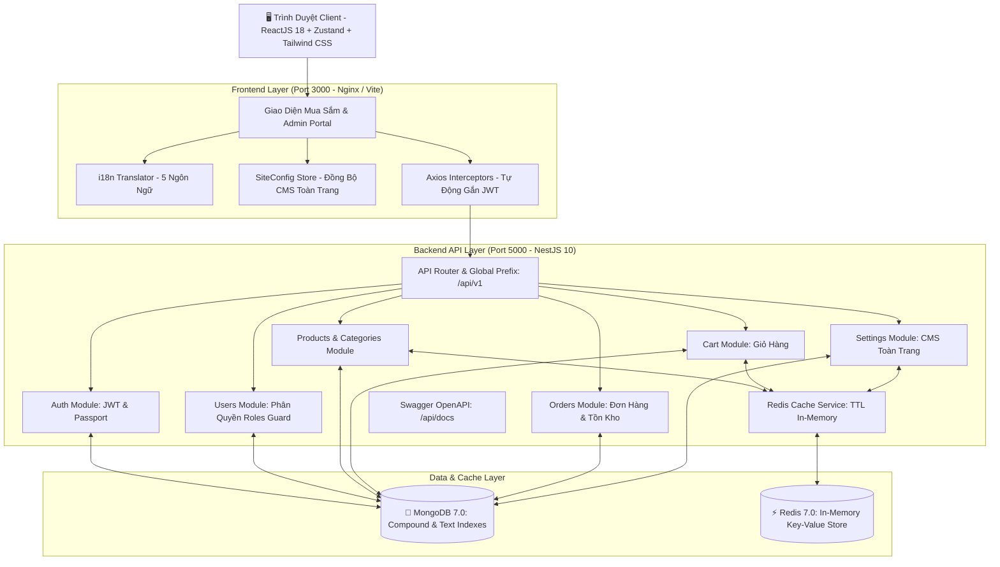
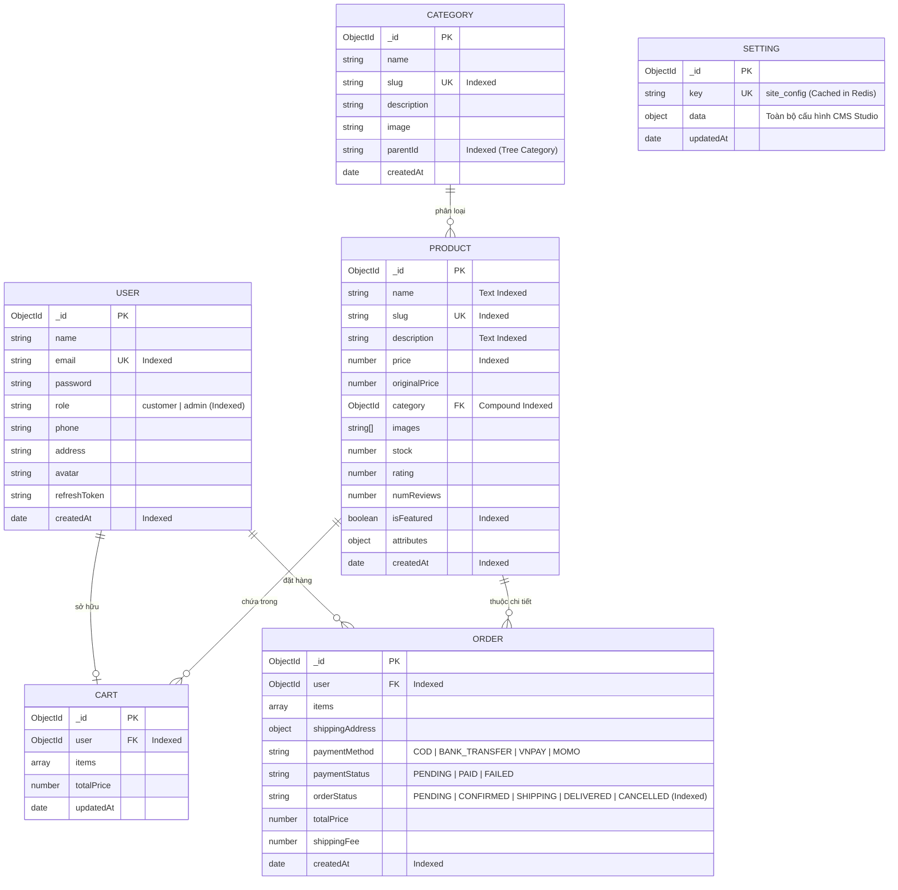

# 🛒 AshaShop - Nền Tảng Thương Mại Điện Tử Thời Trang Cao Cấp (Luxury E-Commerce Platform)

> **Hệ Thống Thương Mại Điện Tử Toàn Diện & Hệ Quản Trị Nội Dung Toàn Trang (CMS Studio)**  
> *Đề tài Báo Cáo Thực Tập Tốt Nghiệp Chuyên Ngành Công Nghệ Thông Tin*

[](https://nestjs.com/)
[](https://reactjs.org/)
[](https://www.typescriptlang.org/)
[](https://www.mongodb.com/)
[](https://redis.io/)
[](https://tailwindcss.com/)
[](https://www.docker.com/)
[](LICENSE)

---

## 📖 1. Giới Thiệu Tổng Quan (Introduction)

**AshaShop** là nền tảng thương mại điện tử chuyên ngành thời trang cao cấp được xây dựng theo chuẩn công nghiệp (Production-ready), kiến trúc phân lớp sạch (Clean Modular Architecture), tối ưu hóa hiệu năng với bộ nhớ đệm đa tầng (Multi-tier Caching) và hỗ trợ quốc tế hóa toàn diện (5 ngôn ngữ).

Hệ thống cung cấp trải nghiệm mua sắm hiện đại cho khách hàng và bộ công cụ quản trị nội dung linh hoạt (**CMS Studio**) cho phép ban quản trị can thiệp, tùy biến mọi khối giao diện, tiêu đề, ảnh Lookbook và danh sách sản phẩm hiển thị trên trang chủ mà không cần chỉnh sửa mã nguồn.

---

## 🌟 2. Tính Năng Nổi Bật (Key Features)

### 🛍️ Dành Cho Khách Hàng (Customer Experience):
- 🌐 **Đa Ngôn Ngữ Tự Động (i18n)**: Hỗ trợ 5 ngôn ngữ chính (**Tiếng Việt**, **English**, **中文 (Tiếng Trung)**, **한국어 (Tiếng Hàn)**, **日本語 (Tiếng Nhật)**) với cơ chế dịch động (Dynamic Lexicon Translation) từ Header, Danh mục, Sản phẩm đến Footer.
- 🗂️ **Danh Mục Phân Cấp Cha - Con (Category Tree)**: Hiển thị danh mục cha kèm menu con dạng Flyout Popover mượt mà, hỗ trợ lọc theo danh mục chuẩn SEO.
- ⚡ **Flash Sale & Đồng Hồ Đếm Ngược**: Khối đếm ngược theo thời gian thực (Days, Hours, Minutes, Seconds) kèm nhãn giảm giá và thanh điều khiển Slider Dots tiện lợi.
- 🎨 **Bộ Sưu Tập Lookbook & Bento Grid**: Trình diễn bộ sưu tập thời trang theo phong cách Bento Grid hiện đại và Hero Carousel sinh động.
- 🔍 **Tìm Kiếm & Bộ Lọc Nâng Cao**: Tìm kiếm thời gian thực theo từ khóa, lọc theo khoảng giá, lọc theo danh mục con, sắp xếp theo giá tăng/giảm, hàng mới về, đánh giá cao nhất.
- 🛒 **Giỏ Hàng & Danh Sách Yêu Thích (Wishlist)**: Thêm/xóa sản phẩm, cập nhật số lượng, áp dụng mã giảm giá (Coupon Code), đồng bộ với bộ nhớ đệm Redis và Database.
- 💳 **Thanh Toán Đa Dạng (Checkout & Payment)**: Hỗ trợ COD (Thanh toán khi nhận hàng), Chuyển khoản ngân hàng (Hiển thị mã QR và số tài khoản động do Admin thiết lập).
- 📦 **Quản Lý Đơn Hàng Cá Nhân**: Theo dõi tiến trình đơn hàng (Chờ xác nhận, Đang giao, Đã giao, Đã hủy) và tính năng tự hủy đơn hoàn lại tồn kho tự động.
- 👤 **Hồ Sơ Cá Nhân & Đổi Mật Khẩu**: Quản lý thông tin liên hệ, sổ địa chỉ và cập nhật mật khẩu bảo mật.

---

### 👑 Dành Cho Quản Trị Viên (Admin & CMS Studio):
- 📊 **Bảng Điều Khiển (Dashboard Metrics)**: Thống kê tổng doanh thu thực tế, số lượng đơn hàng, đơn chờ xử lý, số sản phẩm tồn kho và bảng đơn hàng mới nhất.
- 👗 **Quản Lý Sản Phẩm (Product Management)**: Thêm, sửa, xóa, tìm kiếm, lọc theo danh mục, tải ảnh lên trực tiếp, quản lý tồn kho và giá niêm yết/giá khuyến mãi.
- 📁 **Quản Lý Danh Mục Quần Áo (Categories)**: Tạo danh mục cha/con, cập nhật phân cấp, quản lý ảnh đại diện danh mục.
- 🛍️ **Quản Lý Đơn Hàng (Order Processing)**: Cập nhật trạng thái đơn hàng (PENDING ➔ CONFIRMED ➔ SHIPPING ➔ DELIVERED ➔ CANCELLED) và quản lý trạng thái thanh toán.
- 🏷️ **Quản Lý Mã Giảm Giá (Coupons)**: Thiết lập mã voucher, phần trăm giảm giá, ngày hết hạn và kích hoạt/tạm dừng.
- 👥 **Quản Lý Người Dùng & Phân Quyền**: Quản lý danh sách khách hàng và quản trị viên, phân quyền vai trò (Admin / Customer).
- ✨ **CMS Studio Toàn Trang (Modular Site Management)**:
  - 🎨 **Logo & Thương Hiệu (`/admin/cms/branding`)**: Thay đổi logo, favicon, tên cửa hàng, slogan thương hiệu.
  - 📢 **Thanh Thông Báo Header (`/admin/cms/topbar`)**: Tùy chỉnh thông báo sale, link mua ngay, hotline đầu trang.
  - ✨ **Khối Sản Phẩm Trang Chủ (`/admin/cms/sections`)**: Tùy biến tiêu đề, nhãn huy hiệu và **chọn sản phẩm thủ công (Custom Selection)** bằng popup tìm kiếm/lọc trực quan cho Flash Sale, Mẫu Bán Chạy Nhất, Khám Phá Sản Phẩm.
  - 🖼️ **Banner Hero Lookbook (`/admin/cms/hero`)**: Quản lý slide ảnh lookbook, tiêu đề và link hành động.
  - 🔲 **Lookbook 4 Ô Bento Grid (`/admin/cms/bento`)**: Thay đổi tiêu đề, mô tả và ảnh 4 ô Bento Grid thời trang.
  - 🛡️ **3 Cam Kết Dịch Vụ (`/admin/cms/badges`)**: Tùy biến chính sách giao hàng, tư vấn stylist và đổi size.
  - 📖 **Nội Dung Giới Thiệu (`/admin/cms/about`)**: Chỉnh sửa câu chuyện thương hiệu trang About Us.
  - 📞 **Chân Trang & Hotline (`/admin/cms/footer`)**: Cập nhật hotline, email hỗ trợ, địa chỉ showroom, link mạng xã hội và bản quyền.
  - 💳 **Tài Khoản Ngân Hàng (`/admin/cms/banking`)**: Cập nhật ngân hàng thụ hưởng, số tài khoản, tên chủ thẻ và chi nhánh.

---

## 🏛️ 3. Sơ Đồ Kiến Trúc Hệ Thống (System Architecture)



---

## 🗄️ 4. Mô Hình Cơ Sở Dữ Liệu & Tối Ưu Hóa (Database Schema & Indexes)



### ⚡ Các Chiến Lược Tối Ưu CSDL (Database Optimization):
1. **Compound Indexes**:
   - `ProductSchema`: `{ category: 1, createdAt: -1 }`, `{ isFeatured: 1, createdAt: -1 }`, `{ price: 1 }`.
   - `OrderSchema`: `{ user: 1, createdAt: -1 }`, `{ orderStatus: 1, createdAt: -1 }`.
   - `CategorySchema`: `{ parentId: 1, createdAt: 1 }`.
2. **Text Search Index**:
   - Tìm kiếm toàn văn (Full-text Search) trên `name` và `description` của sản phẩm.
3. **Redis In-Memory Caching Layer**:
   - Tự động cache danh sách sản phẩm, danh mục, giỏ hàng và cài đặt `site_config` với TTL 3600s.
   - Tự động xóa hoặc cập nhật cache khi Admin thêm/sửa/xóa dữ liệu.

---

## 📁 5. Cấu Trúc Thư Mục Dự Án (Project Structure)

```text
AshaShop/
├── backend/                             # NestJS API Server (TypeScript)
│   ├── src/
│   │   ├── common/                      # Guards, Interceptors, Filters, Decorators
│   │   ├── config/                      # Cấu hình môi trường (App, DB, Redis, JWT)
│   │   ├── database/                    # Mongoose Connection & Database Seeder
│   │   │   └── seed.ts                  # File nạp dữ liệu mẫu ban đầu
│   │   ├── modules/                     # Các Modules nghiệp vụ độc lập
│   │   │   ├── auth/                    # Đăng ký, Đăng nhập, JWT Refresh Token
│   │   │   ├── cart/                    # Giỏ hàng & Redis Cache
│   │   │   ├── orders/                  # Xử lý đơn hàng, Thanh toán, Tồn kho
│   │   │   ├── products/                # Sản phẩm & Phân cấp danh mục (Tree)
│   │   │   ├── redis/                   # Redis Cache Service (ioredis)
│   │   │   ├── settings/                # Lưu trữ cấu hình CMS Studio toàn trang
│   │   │   └── users/                   # Quản lý tài khoản & Phân quyền
│   │   ├── app.module.ts                # Root Module
│   │   └── main.ts                      # Entrypoint (Swagger, CORS, Validation)
│   ├── Dockerfile                       # Multi-stage Dockerfile cho Backend
│   └── package.json
│
├── frontend/                            # React 18 SPA (Vite + TypeScript + Tailwind CSS)
│   ├── src/
│   │   ├── components/                  # UI Components tái sử dụng
│   │   │   ├── admin/                   # AdminLayout, Admin Sidebar, Metric Cards
│   │   │   ├── common/                  # Header, Footer, ProductCard, ProductSelectorModal, ImageUpload
│   │   │   └── protected/               # ProtectedRoute (Customer / Admin Guard)
│   │   ├── i18n/                        # Hệ thống dịch thuật 5 ngôn ngữ & Translator
│   │   │   ├── translations.ts          # Từ điển tĩnh 5 thứ tiếng
│   │   │   └── translator.ts            # Bộ dịch động toàn diện (Dynamic Lexicon)
│   │   ├── pages/                       # Các trang giao diện chính
│   │   │   ├── admin/                   # Các trang quản trị Admin
│   │   │   │   ├── cms/                 # 9 Trang quản trị CMS Studio độc lập
│   │   │   │   │   ├── AdminCMSBranding.tsx
│   │   │   │   │   ├── AdminCMSTopbar.tsx
│   │   │   │   │   ├── AdminCMSProductSections.tsx  # Tùy biến tiêu đề & chọn sản phẩm
│   │   │   │   │   ├── AdminCMSHero.tsx
│   │   │   │   │   ├── AdminCMSBento.tsx
│   │   │   │   │   ├── AdminCMSBadges.tsx
│   │   │   │   │   ├── AdminCMSAbout.tsx
│   │   │   │   │   ├── AdminCMSFooter.tsx
│   │   │   │   │   └── AdminCMSBanking.tsx
│   │   │   │   ├── AdminDashboard.tsx   # Thống kê doanh thu & đơn hàng
│   │   │   │   ├── AdminProducts.tsx    # CRUD sản phẩm thời trang
│   │   │   │   ├── AdminCategories.tsx  # Quản lý danh mục cha - con
│   │   │   │   ├── AdminOrders.tsx      # Xử lý đơn hàng
│   │   │   │   ├── AdminCoupons.tsx     # Quản lý mã giảm giá
│   │   │   │   └── AdminUsers.tsx       # Quản lý tài khoản & phân quyền
│   │   │   ├── Home.tsx                 # Trang chủ Lookbook, Flash Sale, Bán chạy, Khám phá
│   │   │   ├── Shop.tsx                 # Trang cửa hàng & Bộ lọc đa năng
│   │   │   ├── ProductDetail.tsx        # Chi tiết sản phẩm, chọn Size/Màu
│   │   │   ├── Cart.tsx                 # Giỏ hàng & áp mã voucher
│   │   │   ├── Checkout.tsx             # Đặt hàng & thanh toán
│   │   │   ├── OrderHistory.tsx         # Lịch sử đơn hàng
│   │   │   ├── Profile.tsx              # Hồ sơ & đổi mật khẩu
│   │   │   ├── Login.tsx                # Đăng nhập (Có nút demo 1-click)
│   │   │   └── Register.tsx             # Đăng ký tài khoản mới
│   │   ├── services/                    # Axios API Client & Endpoints
│   │   ├── store/                       # Zustand Global Stores (Auth, Cart, Language, SiteConfig)
│   │   ├── types/                       # TypeScript Interface & Type Definitions
│   │   ├── App.tsx                      # Định tuyến Router & Quản lý Layout
│   │   └── main.tsx                     # React DOM Entrypoint
│   ├── nginx.conf                       # Cấu hình Nginx phục vụ SPA trong Docker
│   ├── Dockerfile                       # Multi-stage Dockerfile cho Frontend
│   └── package.json
│
├── docker-compose.yml                   # Khởi chạy MongoDB, Redis, Backend, Frontend
└── README.md                            # Tài liệu báo cáo dự án
```

---

## 🚀 6. Hướng Dẫn Cài Đặt & Khởi Chạy (Quick Start)

### Cách 1: Khởi Chạy Siêu Tốc Bằng Docker Compose (Khuyên Dùng)

Chỉ với **1 câu lệnh**, hệ thống sẽ tự động cài đặt các phụ thuộc, biên dịch TypeScript, tạo container và kết nối mạng giữa các dịch vụ:

```bash
# Clone repository (nếu chưa có)
git clone https://github.com/manhtuan28/AshaShop.git
cd AshaShop

# Khởi chạy toàn bộ hệ thống ở chế độ ngầm (-d) và tự động build lại image (--build)
docker compose up -d --build

# Xem log các dịch vụ đang chạy
docker compose logs -f

# Dừng hệ thống khi cần
docker compose down
```

Sau khi khởi chạy thành công:
- 🌐 **Giao diện Website & CMS Admin**: [http://localhost:3000](http://localhost:3000)
- ⚙️ **Backend RESTful API**: [http://localhost:5000/api/v1](http://localhost:5000/api/v1)
- 📚 **Tài liệu Swagger OpenAPI**: [http://localhost:5000/api/docs](http://localhost:5000/api/docs)
- 🍃 **MongoDB Service**: `localhost:27017`
- ⚡ **Redis Cache Service**: `localhost:6379`

---

### Cách 2: Khởi Chạy Thủ Công Trên Máy Cục Bộ (Local Development)

#### Bước 1: Khởi động Database & Cache
Sử dụng Docker để bật MongoDB và Redis:
```bash
docker run -d --name ashashop_mongo -p 27017:27017 mongo:7.0
docker run -d --name ashashop_redis -p 6379:6379 redis:7-alpine
```

#### Bước 2: Cài đặt và chạy Backend (NestJS)
```bash
cd backend

# Cài đặt thư viện
npm install

# Nạp dữ liệu mẫu ban đầu (Tài khoản Admin, Khách hàng, Danh mục cha/con, Sản phẩm thời trang)
npm run seed

# Khởi chạy server ở chế độ Development (Hot-reload)
npm run start:dev
```

#### Bước 3: Cài đặt và chạy Frontend (React + Vite)
Mở một cửa sổ Terminal khác:
```bash
cd frontend

# Cài đặt thư viện
npm install

# Chạy Vite Dev Server
npm run dev
```
Truy cập giao diện tại `http://localhost:5173` (hoặc `http://localhost:3000`).

---

## 🔑 7. Tài Khoản Demo (Demo Credentials)

Tại màn hình [Đăng Nhập](http://localhost:3000/login) có sẵn **2 nút bấm tự động điền nhanh tài khoản demo** giúp thuận tiện cho việc thuyết trình và kiểm thử:

| Vai trò | Email đăng nhập | Mật khẩu | Quyền hạn & Phân hệ |
| :--- | :--- | :--- | :--- |
| **Quản Trị Viên (Admin)** | `admin@ashashop.com` | `admin123456` | Toàn quyền Quản trị Dashboard, Quản lý Sản phẩm, Danh mục, Đơn hàng, Voucher, Người dùng và Toàn bộ hệ thống CMS Studio |
| **Khách Hàng (Customer)** | `customer@ashashop.com` | `customer123456` | Mua hàng, Giỏ hàng, Wishlist, Đặt đơn hàng, Đổi mật khẩu cá nhân |

---

## 📑 8. Danh Sách RESTful API Endpoints Chính

| Module | Phương thức | Endpoint | Mô tả & Phân quyền |
| :--- | :--- | :--- | :--- |
| **Auth** | `POST` | `/api/v1/auth/register` | Đăng ký tài khoản khách hàng mới |
| | `POST` | `/api/v1/auth/login` | Đăng nhập (Trả về Access Token & Refresh Token) |
| | `POST` | `/api/v1/auth/refresh-token` | Cấp lại Access Token mới |
| | `POST` | `/api/v1/auth/logout` | Đăng xuất và hủy Refresh Token |
| | `GET` | `/api/v1/auth/me` | Lấy thông tin tài khoản đang đăng nhập |
| **Products** | `GET` | `/api/v1/products` | Lấy danh sách sản phẩm (Lọc danh mục, tìm kiếm, sắp xếp, phân trang) *(Redis Cache)* |
| | `GET` | `/api/v1/products/featured` | Lấy danh sách sản phẩm nổi bật *(Redis Cache)* |
| | `GET` | `/api/v1/products/slug/:slug` | Lấy chi tiết sản phẩm theo đường dẫn thân thiện (slug) |
| | `GET` | `/api/v1/products/categories` | Lấy danh sách danh mục cha & con *(Redis Cache)* |
| | `POST` | `/api/v1/products` | `[Admin]` Thêm sản phẩm mới (Tự động xóa cache Redis) |
| | `PATCH` | `/api/v1/products/:id` | `[Admin]` Cập nhật thông tin sản phẩm |
| | `DELETE` | `/api/v1/products/:id` | `[Admin]` Xóa sản phẩm khỏi hệ thống |
| **Cart** | `GET` | `/api/v1/cart` | Lấy danh sách giỏ hàng của người dùng *(Redis Cache)* |
| | `POST` | `/api/v1/cart/add` | Thêm sản phẩm vào giỏ |
| | `PATCH` | `/api/v1/cart/update` | Cập nhật số lượng sản phẩm trong giỏ |
| | `DELETE` | `/api/v1/cart/item/:productId` | Xóa 1 sản phẩm khỏi giỏ |
| | `DELETE` | `/api/v1/cart/clear` | Xóa sạch giỏ hàng |
| **Orders** | `POST` | `/api/v1/orders` | Tạo đơn hàng mới (Tự động trừ tồn kho, xóa giỏ hàng) |
| | `GET` | `/api/v1/orders/my-orders` | Xem lịch sử đơn hàng của cá nhân |
| | `GET` | `/api/v1/orders/:id` | Xem chi tiết 1 đơn hàng cụ thể |
| | `PATCH` | `/api/v1/orders/:id/cancel` | Hủy đơn hàng cá nhân (Tự động hoàn trả tồn kho) |
| | `GET` | `/api/v1/orders/admin/stats` | `[Admin]` Thống kê tổng doanh thu & số lượng đơn hàng |
| | `GET` | `/api/v1/orders/admin/all` | `[Admin]` Lấy danh sách tất cả đơn hàng hệ thống |
| | `PATCH` | `/api/v1/orders/:id/status` | `[Admin]` Cập nhật trạng thái đơn hàng & thanh toán |
| **Settings (CMS)** | `GET` | `/api/v1/settings` | Lấy cấu hình CMS toàn trang (`site_config`) *(Redis Cache)* |
| | `POST` | `/api/v1/settings` | `[Admin]` Cập nhật cấu hình CMS toàn trang (Tự động cập nhật Redis) |
| **Users** | `GET` | `/api/v1/users` | `[Admin]` Lấy danh sách tài khoản người dùng |
| | `POST` | `/api/v1/users` | `[Admin]` Tạo tài khoản mới |
| | `PATCH` | `/api/v1/users/:id/role` | `[Admin]` Cập nhật phân quyền vai trò (Admin / Customer) |
| | `DELETE` | `/api/v1/users/:id` | `[Admin]` Xóa tài khoản người dùng |

---

## ☁️ 9. Hướng Dẫn Triển Khai Lên Nền Tảng Đám Mây (Cloud Deployment)

### 1. Cơ sở dữ liệu: MongoDB Atlas Cloud (Free Tier)
1. Đăng ký tài khoản tại [MongoDB Atlas](https://www.mongodb.com/cloud/atlas).
2. Tạo cụm CSDL miễn phí (M0 Cluster).
3. Trong **Database Access**, tạo User & Mật khẩu.
4. Trong **Network Access**, thêm IP `0.0.0.0/0` (Cho phép truy cập từ mọi nơi).
5. Sao chép chuỗi kết nối: `mongodb+srv://<user>:<password>@cluster0.xxxxx.mongodb.net/ashashop?retryWrites=true&w=majority`.

### 2. Backend Server: Render / Railway
1. Tạo Web Service mới kết nối với Git Repository.
2. Thiết lập:
   - **Root Directory**: `backend`
   - **Build Command**: `npm install && npm run build`
   - **Start Command**: `npm run start:prod`
3. Cấu hình các biến môi trường:
   - `MONGODB_URI`: Chuỗi kết nối từ MongoDB Atlas.
   - `REDIS_HOST` / `REDIS_URL`: (Tùy chọn kết nối Upstash Redis hoặc Redis Cloud).
   - `JWT_SECRET`: Chuỗi bảo mật JWT bí mật.
   - `CORS_ORIGIN`: Domain Frontend (hoặc `*`).

### 3. Frontend SPA: Vercel
1. Kết nối Repository với [Vercel](https://vercel.com).
2. Thiết lập:
   - **Root Directory**: `frontend`
   - **Framework Preset**: `Vite`
   - **Build Command**: `npm run build`
   - **Output Directory**: `dist`
3. Cấu hình biến môi trường:
   - `VITE_API_URL`: URL Backend trên Render (VD: `https://ashashop-api.onrender.com/api/v1`).
4. File `vercel.json` có sẵn trong thư mục `frontend` đảm bảo toàn bộ routing React Router DOM hoạt động trơn tru, không bao giờ bị lỗi 404 khi tải lại trang.

---

## 👨‍💻 10. Tác Giả & Bản Quyền (Author & License)

- **Đơn vị thực hiện**: Báo cáo Thực tập Chuyên ngành Công nghệ Thông tin.
- **Mã nguồn**: Phát hành theo giấy phép [MIT License](LICENSE).
