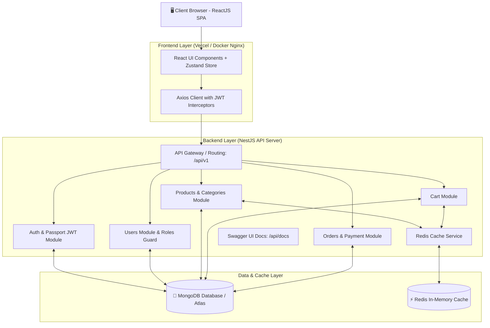
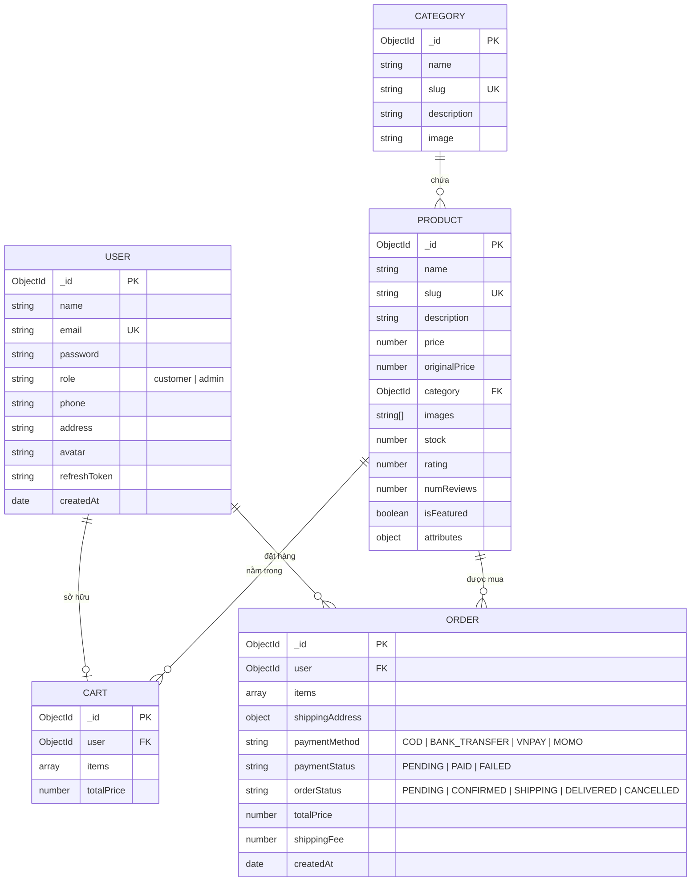

# 🛒 AshaShop - Nền Tảng Thương Mại Điện Tử (E-Commerce Platform)
> **Đề tài Báo Cáo Thực Tập Tốt Nghiệp Chuyên Ngành Công Nghệ Thông Tin**

AshaShop là hệ thống website bán hàng trực tuyến toàn diện, được thiết kế theo kiến trúc chuẩn công nghiệp (Production-ready), hiện đại, tối ưu hiệu năng và bảo mật cao.

---

## 🌟 Công Nghệ Sử Dụng (Tech Stack)

| Thành phần | Công nghệ chính | Chi tiết |
| :--- | :--- | :--- |
| **Frontend** | React 18, Vite, TypeScript | Tailwind CSS, Lucide Icons, Zustand, React Router DOM, Axios, React Hot Toast |
| **Backend API** | NestJS, TypeScript | Clean Architecture, Modular, Class Validator, Swagger OpenAPI, Helmet, Throttler |
| **Cơ sở dữ liệu** | MongoDB 7.0 | Mongoose ODM, MongoDB Atlas Cloud |
| **Bộ nhớ đệm (Cache)** | Redis 7.0 | `ioredis`, tối ưu tốc độ load danh mục, sản phẩm & giỏ hàng |
| **Xác thực & Phân quyền** | JWT (Access + Refresh Token) | `@nestjs/passport`, `passport-jwt`, `bcryptjs`, Roles Guard (Customer / Admin) |
| **Containerization** | Docker & Docker Compose | Multi-stage build tối ưu kích thước image |
| **CI/CD** | GitHub Actions | Tự động hóa kiểm tra Lint, Type check & Build khi Push / Pull Request |
| **Triển khai (Deploy)** | Vercel + Render/Railway | Frontend trên Vercel, Backend trên Render/Railway, Database trên MongoDB Atlas |

---

## 🏛️ Sơ Đồ Kiến Trúc Hệ Thống (System Architecture)



---

## 🗄️ Mô Hình Cơ Sở Dữ Liệu (Database Schema / ERD)



---

## 🚀 Hướng Dẫn Cài Đặt & Chạy Dự Án

### Cách 1: Chạy Siêu Tốc Bằng Docker Compose (Khuyên Dùng)

Chỉ với 1 lệnh duy nhất, toàn bộ hệ thống gồm MongoDB, Redis, Backend NestJS và Frontend React sẽ tự động build và khởi chạy:

```bash
# Khởi động toàn bộ hệ thống
docker compose up -d --build

# Xem log các container đang chạy
docker compose logs -f

# Dừng hệ thống
docker compose down
```

Sau khi khởi chạy:
- 🌐 **Frontend (Giao diện mua sắm & Admin)**: `http://localhost:3000`
- ⚙️ **Backend API**: `http://localhost:5000/api/v1`
- 📚 **Tài liệu Swagger API**: `http://localhost:5000/api/docs`
- 🍃 **MongoDB**: `localhost:27017`
- ⚡ **Redis**: `localhost:6379`

---

### Cách 2: Khởi Chạy Thủ Công (Local Development)

#### 1. Khởi chạy Database & Cache (Docker hoặc Local Services)
```bash
docker run -d --name local_mongo -p 27017:27017 mongo:7.0
docker run -d --name local_redis -p 6379:6379 redis:7-alpine
```

#### 2. Khởi chạy Backend (NestJS)
```bash
cd backend

# Cài đặt thư viện
npm install

# Tạo dữ liệu mẫu ban đầu (Admin, Khách hàng, Danh mục, Sản phẩm)
npm run seed

# Chạy server ở chế độ Development (Hot reload)
npm run start:dev
```

#### 3. Khởi chạy Frontend (React + Vite)
Mở một cửa sổ Terminal mới:
```bash
cd frontend

# Cài đặt thư viện
npm install

# Khởi chạy Vite Dev Server
npm run dev
```

---

## 🔑 Tài Khoản Mẫu (Demo Credentials)

Hệ thống đã chuẩn bị sẵn seeder script nạp dữ liệu mẫu phục vụ trình bày báo cáo:

| Vai trò | Email đăng nhập | Mật khẩu | Quyền hạn |
| :--- | :--- | :--- | :--- |
| **Quản trị viên (Admin)** | `admin@ashashop.com` | `admin123456` | Toàn quyền Dashboard, Quản lý sản phẩm (CRUD), Cập nhật đơn hàng |
| **Khách hàng (Customer)** | `customer@ashashop.com` | `customer123456` | Mua hàng, Giỏ hàng, Đặt đơn, Lịch sử đơn, Chỉnh sửa hồ sơ |

*(Tại màn hình Đăng nhập có sẵn 2 nút bấm tự động điền nhanh tài khoản demo tiện lợi khi demo).*

---

## 📑 Danh Sách API Endpoints Chính (RESTful)

Xem tài liệu trực quan và tương tác trực tiếp tại Swagger UI: `http://localhost:5000/api/docs`.

### 1. Xác thực (Auth)
- `POST /api/v1/auth/register` - Đăng ký tài khoản
- `POST /api/v1/auth/login` - Đăng nhập (trả về Access & Refresh Token)
- `POST /api/v1/auth/refresh-token` - Làm mới Access Token
- `POST /api/v1/auth/logout` - Đăng xuất
- `GET /api/v1/auth/me` - Lấy thông tin user hiện tại

### 2. Sản phẩm & Danh mục (Products & Categories)
- `GET /api/v1/products` - Danh sách sản phẩm (hỗ trợ lọc danh mục, tìm kiếm, khoảng giá, sắp xếp & phân trang) *(Có Redis cache)*
- `GET /api/v1/products/featured` - Danh sách sản phẩm nổi bật *(Có Redis cache)*
- `GET /api/v1/products/slug/:slug` - Chi tiết sản phẩm theo slug
- `GET /api/v1/products/categories` - Danh sách danh mục *(Có Redis cache)*
- `POST /api/v1/products` - `[Admin]` Thêm sản phẩm mới (Tự động xóa cache Redis)
- `PATCH /api/v1/products/:id` - `[Admin]` Cập nhật sản phẩm
- `DELETE /api/v1/products/:id` - `[Admin]` Xóa sản phẩm

### 3. Giỏ hàng (Cart)
- `GET /api/v1/cart` - Lấy giỏ hàng người dùng *(Có Redis cache)*
- `POST /api/v1/cart/add` - Thêm sản phẩm vào giỏ
- `PATCH /api/v1/cart/update` - Cập nhật số lượng
- `DELETE /api/v1/cart/item/:productId` - Xóa 1 sản phẩm
- `DELETE /api/v1/cart/clear` - Xóa sạch giỏ hàng

### 4. Đơn hàng (Orders)
- `POST /api/v1/orders` - Tạo đơn hàng (Trừ tồn kho tự động, xóa giỏ hàng)
- `GET /api/v1/orders/my-orders` - Danh sách đơn hàng cá nhân
- `GET /api/v1/orders/:id` - Chi tiết đơn hàng
- `PATCH /api/v1/orders/:id/cancel` - Hủy đơn hàng (Hoàn trả lại tồn kho sản phẩm)
- `GET /api/v1/orders/admin/stats` - `[Admin]` Thống kê doanh thu & đơn hàng
- `GET /api/v1/orders/admin/all` - `[Admin]` Danh sách tất cả đơn hàng
- `PATCH /api/v1/orders/:id/status` - `[Admin]` Cập nhật trạng thái giao dịch

---

## ☁️ Hướng Dẫn Deploy Lên Cloud

### 1. Database: MongoDB Atlas (Miễn phí)
1. Đăng ký tài khoản tại [MongoDB Atlas](https://www.mongodb.com/cloud/atlas).
2. Tạo 1 Cluster miễn phí (M0 Sandbox).
3. Tại mục **Database Access**, tạo User & Password.
4. Tại mục **Network Access**, cho phép IP `0.0.0.0/0` (Allow Access from Anywhere).
5. Lấy chuỗi kết nối: `mongodb+srv://<username>:<password>@cluster0.xxxxx.mongodb.net/ashashop?retryWrites=true&w=majority`.

### 2. Backend: Render / Railway
1. Đăng nhập [Render.com](https://render.com) hoặc [Railway.app](https://railway.app).
2. Tạo **Web Service** mới kết nối với Repository GitHub của bạn.
3. Cấu hình:
   - **Root Directory**: `backend`
   - **Build Command**: `npm install && npm run build`
   - **Start Command**: `npm run start:prod`
4. Thêm các biến môi trường (Environment Variables):
   - `MONGODB_URI`: Điền connection string từ MongoDB Atlas.
   - `REDIS_HOST` / `REDIS_URL`: (Tùy chọn kết nối Upstash Redis hoặc Redis Cloud).
   - `JWT_SECRET`: Chuỗi bảo mật JWT bất kỳ.
   - `CORS_ORIGIN`: Domain Frontend Vercel (hoặc `*`).

### 3. Frontend: Vercel
1. Đăng nhập [Vercel.com](https://vercel.com) và chọn **Add New Project**.
2. Chọn repo GitHub của dự án.
3. Cấu hình:
   - **Root Directory**: `frontend`
   - **Framework Preset**: `Vite`
   - **Build Command**: `npm run build`
   - **Output Directory**: `dist`
4. Biến môi trường:
   - `VITE_API_URL`: Điền URL backend Render (ví dụ: `https://ashashop-api.onrender.com/api/v1`).
5. Bấm **Deploy**. File `vercel.json` có sẵn sẽ tự động cấu hình điều hướng SPA không bao giờ bị lỗi 404 khi F5.

---

## 👨‍💻 Tác Giả & Bản Quyền
- Dự án phục vụ mục đích học tập và làm bài báo cáo thực tập tốt nghiệp.
- Mọi đóng góp và mã nguồn mở tuân thủ giấy phép MIT.
